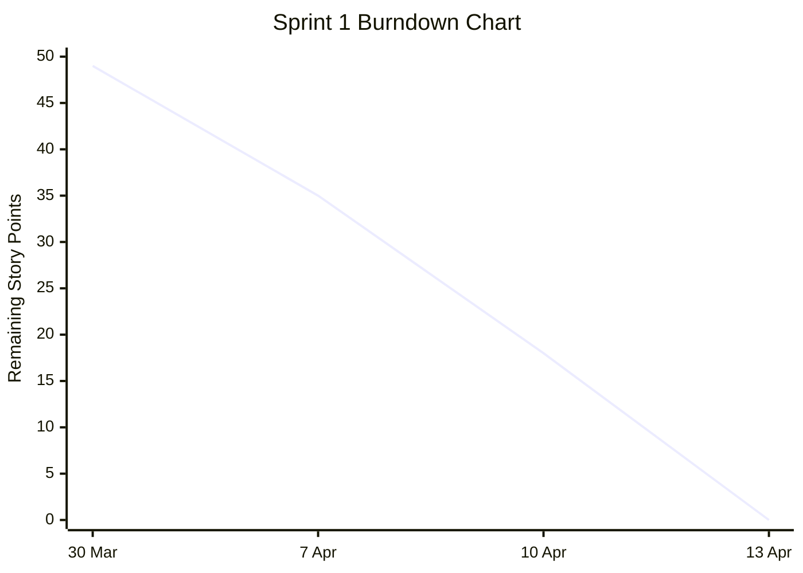
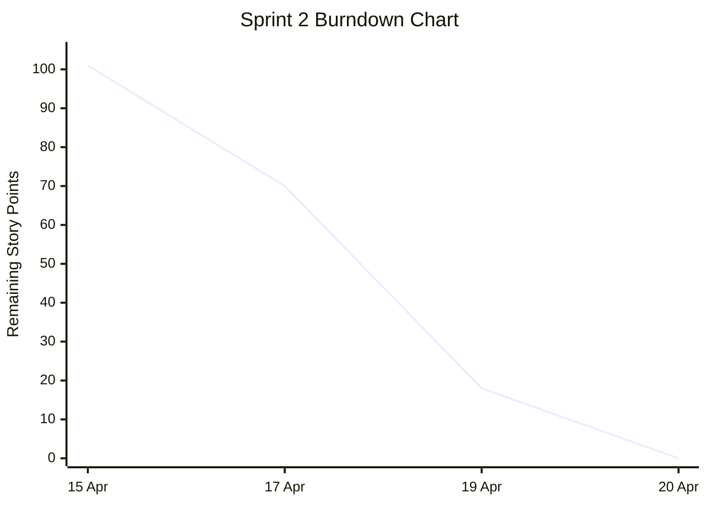
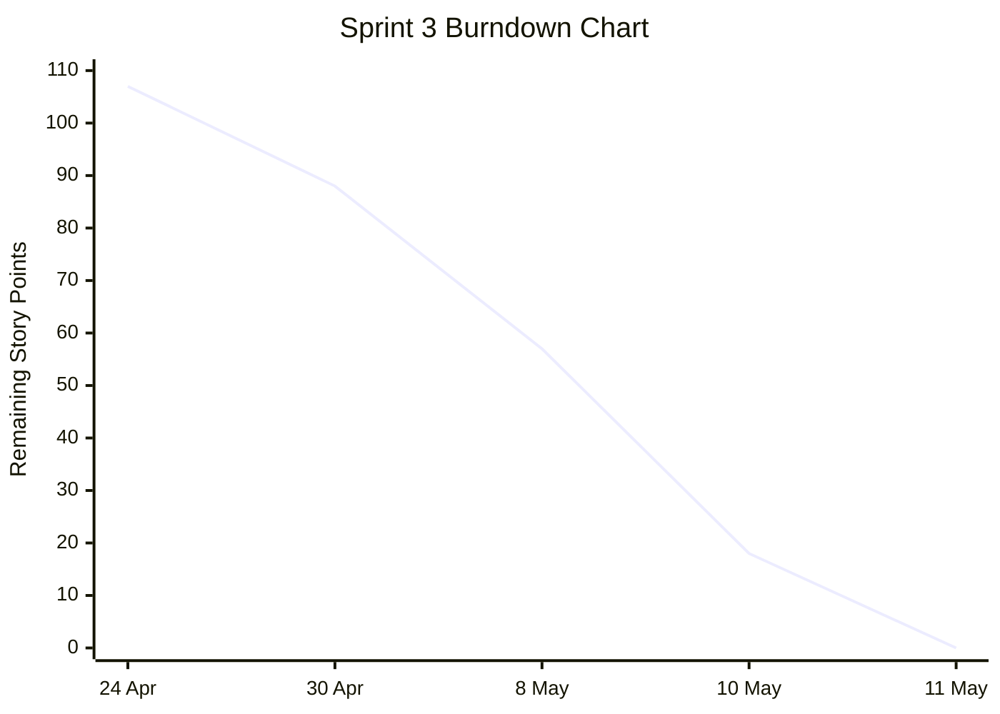
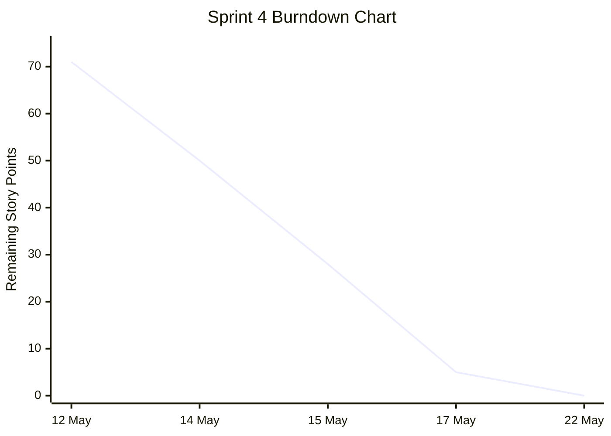

# Sprint Burndown Charts

This document contains the sprint burndown charts for the Campus Food Ordering Platform.

The burndown charts show the estimated remaining story points over time for each sprint.

Story points were based on the sprint backlog estimates recorded in the sprint backlog documentation.

A downward trend shows that work was completed during the sprint.

---

# GitHub Projects Evidence

The sprint work was also tracked using GitHub Projects. Each sprint had its own GitHub Project board, which helped the team monitor backlog items, tasks in progress, review work, and completed work.

## Sprint Project Boards

| Sprint | GitHub Project Board |
|---|---|
| Sprint 1 | https://github.com/users/Raquel9988/projects/2 |
| Sprint 2 | https://github.com/users/Raquel9988/projects/4 |
| Sprint 3 | https://github.com/users/Raquel9988/projects/6 |
| Sprint 4 | https://github.com/users/Raquel9988/projects/7 |

Main GitHub Projects page:

https://github.com/Raquel9988?tab=projects

These GitHub Project boards provide supporting evidence for the burndown charts because they show how the sprint items were organised and tracked throughout the project.

---

# Sprint 1 Burndown Chart

## Sprint 1 Goal

Sprint 1 focused on user verification and menu management.

Main work included:

- Student authentication
- Vendor authentication
- Admin authentication
- Role-based access
- Vendor menu creation
- Menu display
- Admin vendor controls
- GitHub project setup
- Basic CI/CD setup

## Sprint 1 GitHub Project Board

https://github.com/users/Raquel9988/projects/2

## Sprint 1 Burndown Table

| Date | Sprint Event / Progress Point | Remaining Story Points |
|---|---|---:|
| 30 March 2026 | Sprint planning and backlog created | 49 |
| 7 April 2026 | Authentication and CI/CD progress reviewed | 35 |
| 10 April 2026 | Login, registration, and password-related functionality reviewed | 18 |
| 13 April 2026 | Sprint 1 features completed and prepared for review | 0 |

## Sprint 1 Burndown Chart

## Sprint 1 Interpretation

The Sprint 1 burndown shows steady progress from the initial planned work to completion.

Most early work focused on setting up authentication, roles, menu management, and project workflow.

By the final Sprint 1 meeting, the core Sprint 1 features were complete and ready to present.

---

# Sprint 2 Burndown Chart

## Sprint 2 Goal

Sprint 2 focused on the ordering workflow.

Main work included:

- Cart functionality
- Order placement
- Orders database and backend logic
- Vendor orders dashboard
- Order status updates
- Student order tracking
- Real-time updates and notifications

## Sprint 2 GitHub Project Board

https://github.com/users/Raquel9988/projects/4

## Sprint 2 Burndown Table

| Date | Sprint Event / Progress Point | Remaining Story Points |
|---|---|---:|
| 15 April 2026 | Sprint planning and backlog selected | 101 |
| 17 April 2026 | Daily Scrum progress update | 70 |
| 19 April 2026 | Major features completed, minor fixes remaining | 18 |
| 20 April 2026 | Sprint retrospective and sprint completion | 0 |

## Sprint 2 Burndown Chart

## Sprint 2 Interpretation

The Sprint 2 burndown shows a strong downward trend.

The database and backend order logic had to be completed early because the cart, vendor dashboard, order tracking, and notifications depended on it.

By the end of the sprint, the main ordering workflow was complete.

---

# Sprint 3 Burndown Chart

## Sprint 3 Goal

Sprint 3 focused on online payments and dietary features.

Main work included:

- PayFast payment API
- PayFast Sandbox/test mode
- Payment notification endpoint
- Linking payments to orders
- Preventing unpaid orders from being processed
- Payment user interface
- One-vendor cart rule
- Active orders and order history
- Dietary tag selection
- Dietary backend storage
- Student dietary filtering
- UML updates
- Integration testing

## Sprint 3 GitHub Project Board

https://github.com/users/Raquel9988/projects/6

## Sprint 3 Burndown Table

| Date | Sprint Event / Progress Point | Remaining Story Points |
|---|---|---:|
| 24 April 2026 | Sprint planning and backlog selected | 107 |
| 30 April 2026 | Payment and dietary requirements clarified | 88 |
| 8 May 2026 | Payment complete, vendor side complete, dietary work partly in progress | 57 |
| 10 May 2026 | All main Sprint 3 parts completed, final merge/testing remaining | 18 |
| 11 May 2026 | Sprint review completed | 0 |

## Sprint 3 Burndown Chart

## Sprint 3 Interpretation

The Sprint 3 burndown decreased more gradually at first because the sprint contained two large dependency-heavy features: payments and the dietary system.

The payment API and dietary vendor UI had to begin first so that the backend and frontend integration tasks could continue.

The remaining work dropped significantly near the end once payment, vendor, student, and dietary features were integrated and reviewed.

---

# Sprint 4 Burndown Chart

## Sprint 4 Goal

Sprint 4 focused on analytics and final project preparation.

Main work included:

- Analytics data preparation
- Analytics dashboard layout
- Sales per vendor over time report
- Peak ordering hours report
- Custom analytics view
- CSV/PDF report export
- Analytics testing
- Final submission documentation

## Sprint 4 GitHub Project Board

https://github.com/users/Raquel9988/projects/7

## Sprint 4 Burndown Table

| Date | Sprint Event / Progress Point | Remaining Story Points |
|---|---|---:|
| 12 May 2026 | Sprint 4 analytics backlog created | 71 |
| 14 May 2026 | Analytics backend and dashboard structure in progress | 50 |
| 15 May 2026 | Reports and analytics UI mostly completed | 28 |
| 17 May 2026 | Analytics work merged and final documentation in progress | 5 |
| 22 May 2026 | Final submission documentation completed | 0 |

## Sprint 4 Burndown Chart

## Sprint 4 Interpretation

The Sprint 4 burndown shows that most analytics implementation work was completed before the final submission period.

The remaining effort near the end of the sprint was mainly related to final documentation, checking links, adding final artefacts, and preparing the final Moodle submission.

By the final submission date, the analytics work and supporting documentation were completed.

---

# Overall Burndown Summary

| Sprint | Starting Story Points | Ending Story Points | GitHub Project Board | Final Status |
|---|---:|---:|---|---|
| Sprint 1 | 49 | 0 | https://github.com/users/Raquel9988/projects/2 | Completed |
| Sprint 2 | 101 | 0 | https://github.com/users/Raquel9988/projects/4 | Completed |
| Sprint 3 | 107 | 0 | https://github.com/users/Raquel9988/projects/6 | Completed |
| Sprint 4 | 71 | 0 | https://github.com/users/Raquel9988/projects/7 | Completed |

---

# Notes on Burndown Estimates

The burndown values are based on the estimated story points recorded in the sprint backlog documentation.

The values show remaining work at major Scrum progress points, including planning meetings, daily stand-ups, progress meetings, sprint reviews, and retrospectives.

The purpose of these charts is to demonstrate that the team tracked work over time and that remaining sprint effort generally decreased as tasks were completed.

The GitHub Project boards are included as additional evidence because they show the sprint tasks and project workflow used during development.
